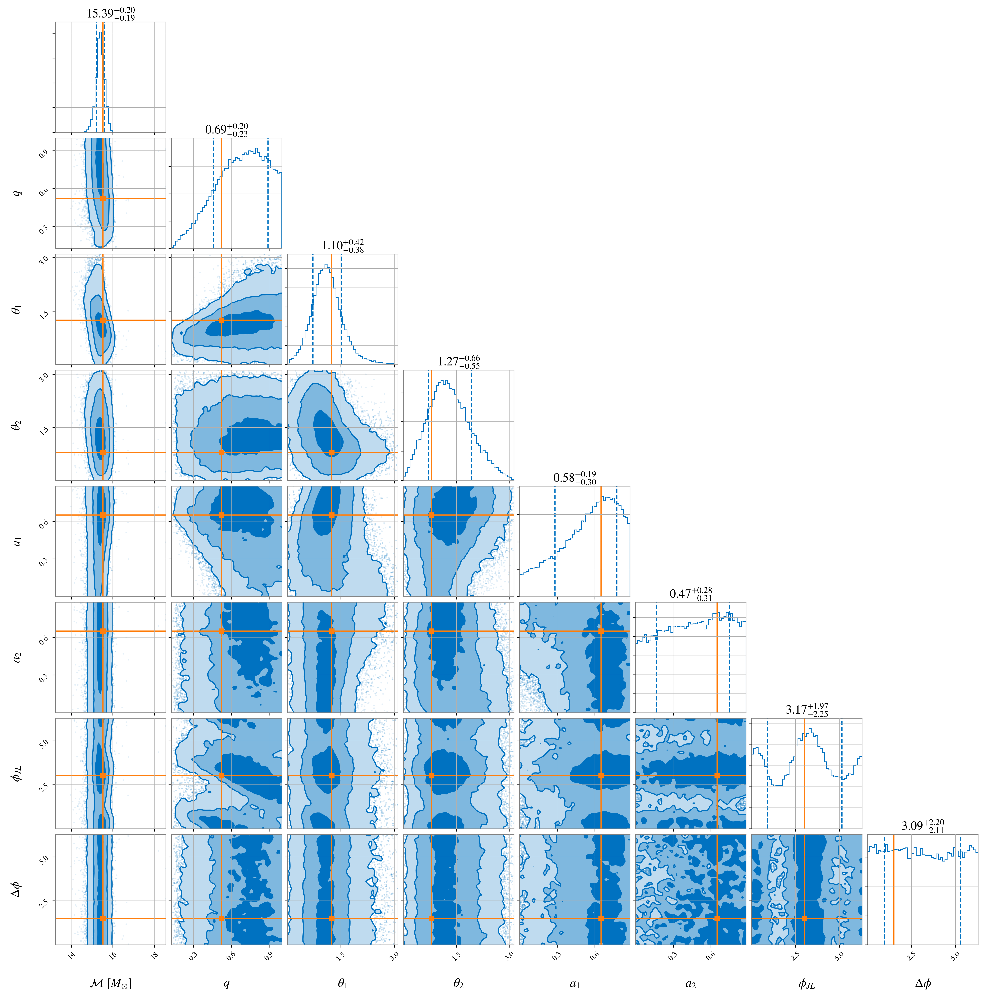
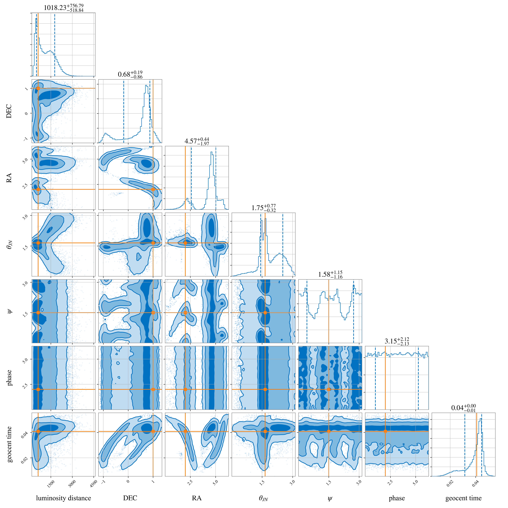

# Fiducial run results

The injected and recovered values of the fiducial injection recovery tests of simulated binary black hole and binary neutron star signals. We quote the symmetric 90% confidence interval around the recovered median for each parameter.

## Fiducial BBH 

### Intrinsic parameters

### Extrinsic parameters

